# ThingJS-X零代码数字孪生开发平台

>**免责声明：**本文档可能包含第三方产品信息，该信息仅供参考。阿里云对第三方产品的性能、可靠性以及操作可能带来的潜在影响，不做任何暗示或其他形式的承诺。

## 概述
ThingJS-X整合了UINO（优锘）过去10年数字孪生项目交付经验，能满足75%以上物联网管理需求及100%可视化效果配置需求。ThingJS-X提供交付平台和一套覆盖全流程的工具链和资源库，实现从模型场景、数据结构、效果设置到数据对接全流程0代码配置交付，不用会编程，不用3D设计，B/S轻量化实施，合作伙伴获得完整的交付能力，100%掌控真数字孪生应用项目落地。本文向您介绍如何开通计算巢上的ThingJS-X服务，以及部署流程和使用说明。

## 计费说明

ThingJS-X零代码数字孪生开发平台服务的费用如下：

* ECS实例、云盘和网络流量的费用为标准费用。
* 云市场镜像费用：

|   包年    |
|--------|
| 38000元/年 |

## RAM账号所需权限
* 由于该服务需要购买云市场镜像，因此您的账号需要有购买云市场镜像商品的权限。
* 该服务需要对ECS、VPC等资源进行访问和创建操作，若您使用RAM用户创建服务实例，需要在创建服务实例前[为RAM用户授权](https://help.aliyun.com/document_detail/121945.html)。所需权限如下表所示。

| 权限策略名称 | 备注 |
| --- | --- |
| AliyunECSFullAccess | 管理云服务器服务（ECS）的权限 |
| AliyunVPCFullAccess | 管理专有网络（VPC）的权限 |
| AliyunROSFullAccess | 管理资源编排服务（ROS）的权限 |
| AliyunComputeNestUserFullAccess | 管理计算巢服务（ComputeNest）的用户侧权限 |
| AliyunCloudMonitorFullAccess | 管理云监控（CloudMonitor）的权限 |

## 部署流程
### 部署步骤
1. 在产品界面选择您想要购买的产品
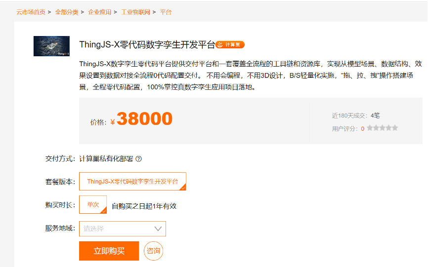

2. 点击立即购买，创建服务实例（配置信息可自定义）
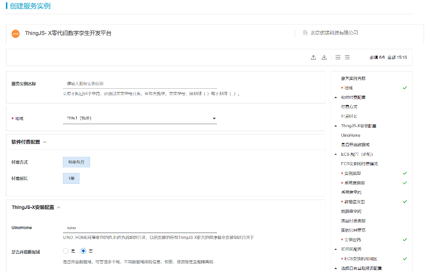
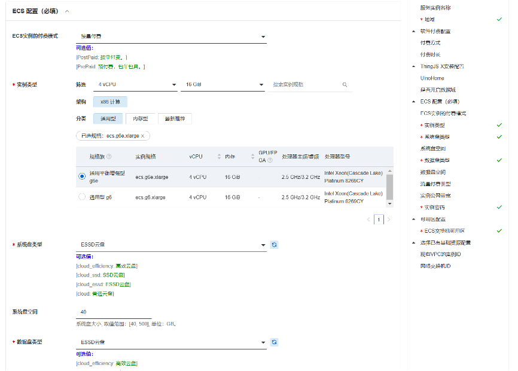
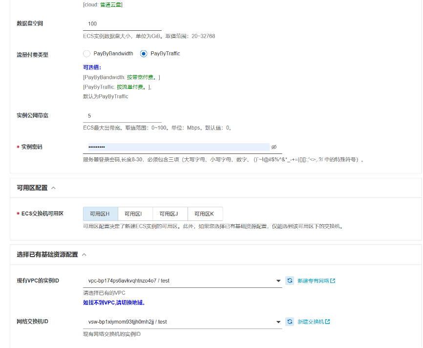

3. 确认服务实例信息
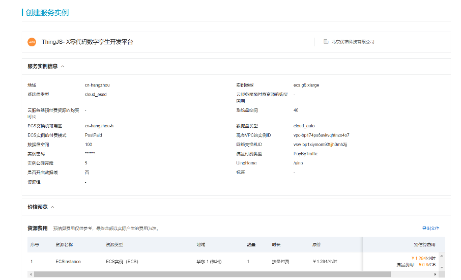
4. 点击确认购买并支付

5. 支付完成后，管理控制台
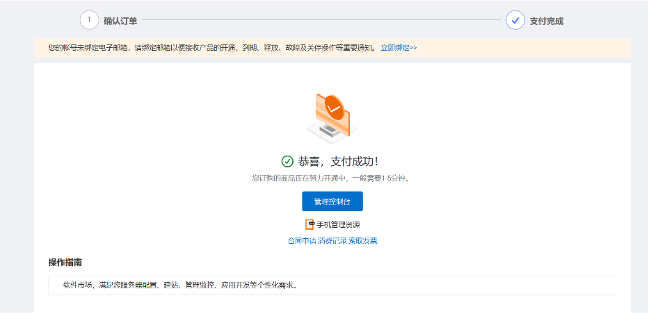
6. 在云市场已购买服务中看到等待状态由开通中转为已开通
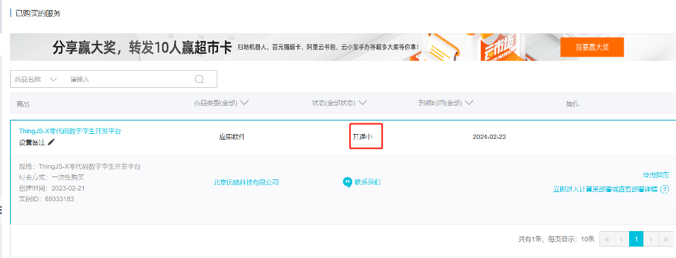

### 验证结果

1. 选择立即进入计算巢部署
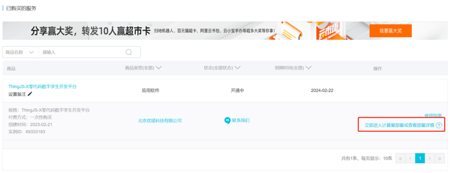
2. 将计算巢状态点击部署，手动部署
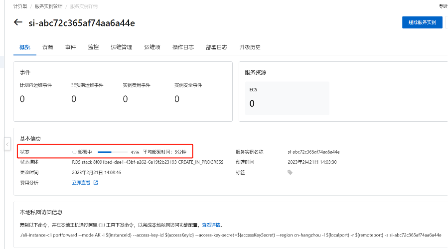
3. 部署完成后，点击ThingJS-X访问地址url，即可跳转至产品页面
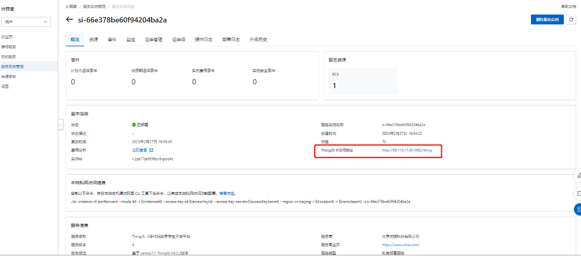
4. 登录产品控制台
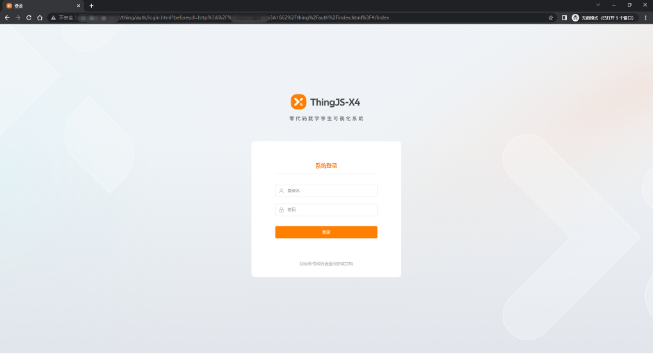
5. 请复制客户识别码发送至邮箱yindirong@uino.com，我们会尽快回复授权许可码
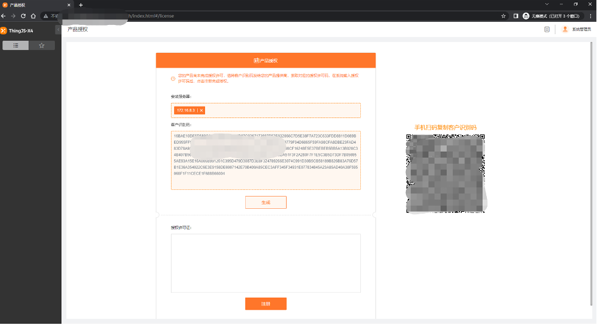

### 使用帮助
- 请访问ThingJS-X官网了解如何使用ThingJS-X：[ThingJS-X使用文档](https://support.thingjs.com/)
- 如果您在安装或使用过程中，遇到任何问题，请致电400-051-0152，我们的工作人员会解决您的问题。
